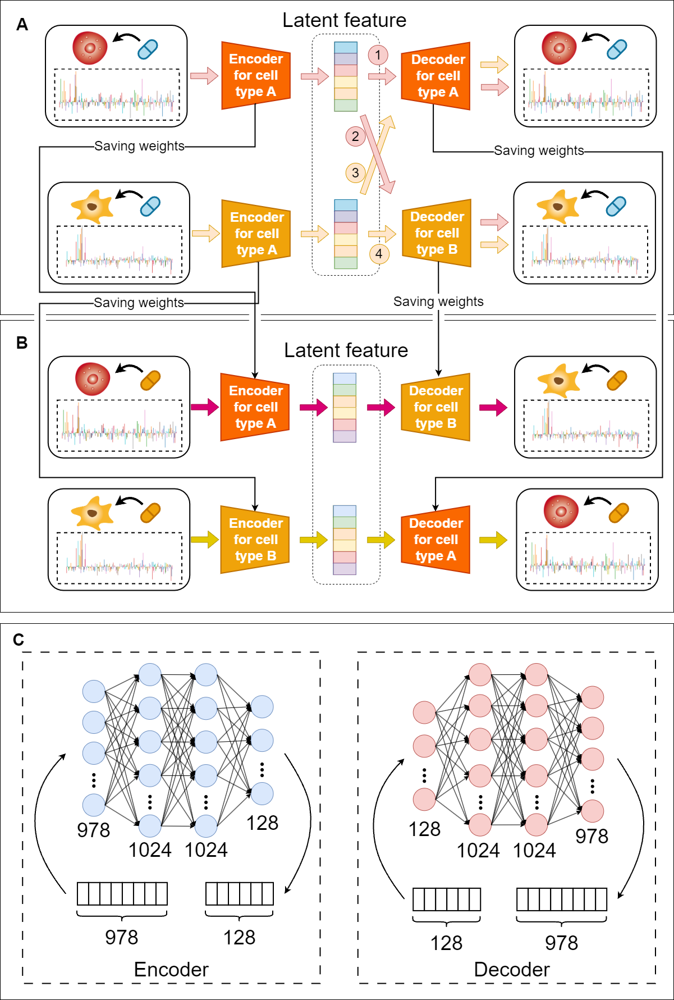

# CDDTR
## CDDTR: Cross-domain autoencoders for predicting cell type specific drug-induced transcriptional responses

*Welcome to your visit!*

*The manuscript is now submitted, and the address of the paper will be posted here after acceptance.*


## 1.Introduction
&emsp;Drug induced transcriptional perturbation can be used for drug repositioning, drug activity prediction and drug combination therapy, etc. Due to the vast combinations of drugs and cell lines, the exhaustive measurements of transcriptional perturbation responses become challenging. There are now some computational methods to predict drug responses, but the mapping between the drug responses of different cell lines is largely overlooked.<br>
&emsp;We propose CDDTR, a cross-domain autoencoder based method, that uses the drug induced response of one cell line to predict the response of another cell line. For the perturbation profiles of over 1500 drugs on seven cell lines in Phase II LINCS data, the Pearson correlation coefficient (PCC) value of CDDTR increases by at least one time compared to baseline based on 10-fold cross-validation. Furthermore, for A375 and PC3 cells, CDDTR achieves significant performance improvements compared to other state-of-the-art methods. The latent features of transcriptional perturbations of A375 and PC3 cells extracted by the trained model have a 0.956 PCC, revealing the competence of CDDTR to predict the cross-cell type responses. By integrating perturbations from multiple cell lines and incorporating pre-training, the predictive performance of CDDTR can be further improved.<br>

## 2.Environmental preparation
The environment variables are shown as follows:

    tensorflow-gpu==2.4.0
	tensorflow==2.4.0
	numpy==1.19.5
	cmapPy==4.0.1
	pandas==1.3.5
	scikit-learn==1.0.2
	scipy==1.10.1
	seaborn==0.12.1
You can directly use pip to configure the environment variables<br>
```python 
>> pip install -r requirements.txt
```
If you need the GPU to run CDDTR, download cudatoolkit and cudnn according to your hardware environment.<br>
Our CUDA is installed in a conda environment
```python 
>> conda install cudatoolkit=Version
>> conda install cudnn
```
## 3.Environmental preparation
In this study, we used chemically induced transcriptional perturbation profiles (GSE70138) from Phase II LINCS-L1000 data. In our analysis plan, we used the expression characteristics of 978 Landmark genes. Replicate-collapsed differential expression signatures (Level 5) of the 978 landmark genes were adopted in our analysis protocol.
### 3.1 Dataset preparation
Download the following data files from https://www.ncbi.nlm.nih.gov/geo/query/acc.cgi?acc=GSE70138
| Files |
| --- |
| GSE92742_Broad_LINCS_gene_info.txt |
| GSE70138_Broad_LINCS_sig_info.txt |
| GSE70138_Broad_LINCS_Level5_COMPZ_n118050x12328.gctx |

The downloaded zip file GSE70138_Broad_LINCS_gene_info_2017-03-06.txt.gz is unzipped to get file GSE92742_Broad_LINCS_gene_info.txt
### 3.2 Create a data file
Put the downloaded data files under the ‘data’ folder and run ‘data_parser.py’. Please note that 'Path to store CDDTR' is the path where you store CDDTR:
```python  
>> cd 'Path to store CDDTR'/CDDTR/data
>> python data_parser.py
```
## 4.Train and test the model
### 4.1 Train the mode
Run ‘Train_model.py’ to train the model. Note that 'Path to store CDDTR' is the path where you store CDDTR.
```python  
>> cd 'Path to store CDDTR'/CDDTR
>> python Train_model.py
```
See what can be adjusted:
```python  
>> python Train_model.py -h
```
```python 
optional arguments:
  -h, --help            show this help message and exit
  -cells CELLS          Train between pairs of cell lines stored in the list
  -pert PERT            Perturbation type
  -fold FOLD            Set 0 to start ten fold cross validation/ 1 for 70 training/ 2 to start training all
  -p_epochs P_EPOCHS    Epochs of training
  -epochs EPOCHS        Epochs of pre training
  -p_lr P_LR            Learning rate of pre training
  -lr LR                Learning rate of training
  -p_batch_size P_BATCH_SIZE
                        Batch size of pre training
  -batch_size BATCH_SIZE
                        Batch size of training
  -input_dropout_rate INPUT_DROPOUT_RATE
                        Dropout rate of inputs
  -lincs_phase LINCS_PHASE
                        Lincs phase
  -save_dir_m SAVE_DIR_M
                        The folder where the model parameters are stored
  -save_dir_r SAVE_DIR_R
                        The folder where the test results are stored
  -pre_train PRE_TRAIN  Whether to use pre training
  -result_txt RESULT_TXT
                        The file name where the results are saved as txt, txt is saved in save_dir_r
```
The default values are as follows：
| name | default | type | name | default | type |
| --- | --- | --- | --- | --- | --- |
| -cells | ['A375', 'PC3'] | list | -batch_size | 128 | int |
| -pert | 'trt_cp' | str | -input_dropout_rate | 0.1 | float |
| -fold | 0 | int | -lincs_phase | '2' | str |
| -p_epochs | 1000 | int | -save_dir_m | './model_weights' | str |
| -epochs | 1000 | int | -save_dir_r | './result' | str |
| -p_lr | 1e-4 | float | -pre_train | False | bool |
| -lr | 2e-4 | float | -result_txt | 'result' | str |
| -p_batch_size | 128 | int |   |  |  |

*Note that if you train different models, store them in different paths by setting ‘-save_dir_m’, otherwise the newly trained model will overwrite the previously trained model.*
### 4.2 Test the model
Run Test_model.py to test the model. Note that 'Path to store CDDTR' is the path where you store CDDTR.
```python  
>> cd 'Path to store CDDTR'/CDDTR
>> python Test_model.py
```
You can change the storage location of test results by setting ‘-save_dir_r’, and change the txt file name used to save test results by setting ‘-result_txt’.
